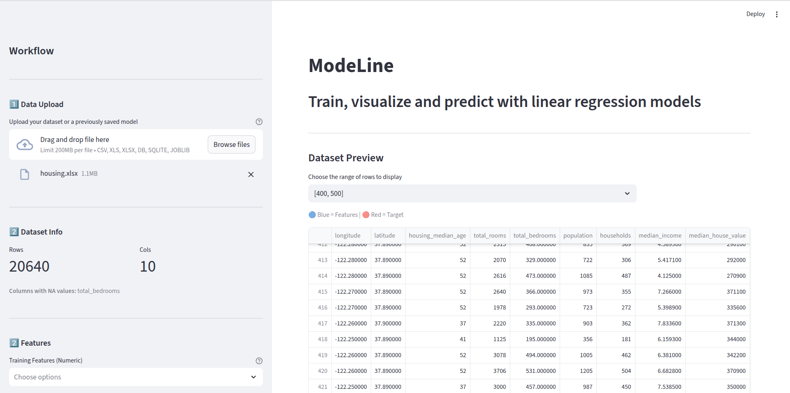
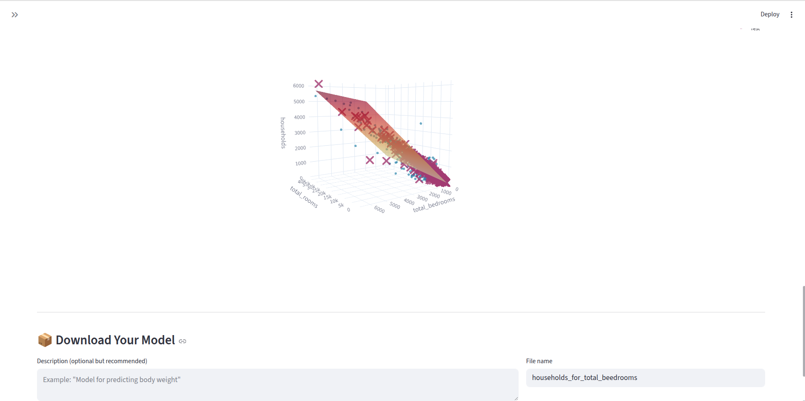

# ModeLine


**ModeLine** is a web application for creating and visualizing simple and multiple linear regression models with minimal effort.

---

## Contents

- [About](#about)
- [Features](#features)
- [Visuals](#visuals)
- [Installation](#installation)
- [Usage](#usage)
- [Feedback and Contributions](#feedback-and-contributions)
- [License](#license)
- [Support](#support)
- [Contacts](#contacts)

---

## About

ModeLine is an easy-to-use application for creating and visualizing linear regression models from any datasets. Users can upload datasets in multiple formats: .csv, .xslx, .db, etc. But also load previously saved scikit-learn models in a Modeline-Joblib format.

The results can be visualized whit a clean, modern UI. The app provides: the model formula, evaluation metrics (R², MSE), descriptive and interactive charts using Plotly, functionalities to make predictions with your model and the option to download the models you create for reusability.

ModeLine adheres to high standards of flexibility, reusability, and reliability, utilizing a well-known software design methodology (Scrum) and patterns. These patterns ensure the following benefits:

  - Modularity: Different parts of the library can function independently, enhancing the library's modularity and allowing for easier maintenance and updates.
  - Testability: Improved separation of concerns makes the code more testable.
  - Maintainability: Clear structure and separation facilitate better management of the codebase.

This project is ideal for students learning linear regression, beginner programmers, or experienced users like data scientists who need to quickly create regression models.

---

## Features

- Simple and modern web interface
- Multiple dataset format support
- Data preprocessing (null handling, parameters selection, generation seed...)
- Create simple and multiple linear regression models
- Interactive visualization of results
- Save and reload models easily
- Quick predictions from trained models

---

## Visuals



---

## Installation

Start using ModeLine with the following steps:
  
```bash
# Clone the repository
git clone https://github.com/YareBE/ModeLine.git
cd Modeline

# Create a virtual environment (optional but recommended)
python -m venv .venv
source .venv/bin/activate

# Install dependencies
pip install -r requirements.txt

# Run the application
streamlit run src/frontend/modeline.py
```

---

## Usage

Once the app is running:

1. Upload a dataset (`.csv`, `.xlsx`, etc.) or load an existing model (`.joblib`).
2. If you loaded a model, you can immediately visualize its results and make predictions.
3. If you uploaded a new dataset, select the features and target variable for your regression model.
4. Handle missing values by choosing a substitution method: Mean, Median, Delete, or Constant.
5. View the model formula, evaluation metrics (R², MSE), and interactive plots.
6. Make predictions or download the trained model for reuse.

---

## Feedback and Contributions
We've made every effort to make out application the most complete possible, however we may have encountered many errors. Whether you have feedback on features, have encountered any bugs, or have suggestions for enhancements, we're eager to hear from you. Your insights make ModeLine more robust and user-friendly.

Please feel free to contribute by submitting an issue or joining the discussions. Each contribution helps us to grow and improve. Please check [CONTRIBUTING.md](https://github.com/YareBE/ModeLine/blob/main/docs/CONTRIBUTING.md) for further details.

We appreciate your support and look forward to making our product even better with your help!

---

## License

This software is licensed under the [MIT LICENSE](https://github.com/YareBE/ModeLine/blob/main/LICENSE)

---

## Contacts

For more details about out products, services, or any general information regarding the application, feel free to reach out to us. We are here to provide support and answer any questions you may have. You can contact our team at:

- Pablo Fernández Ríos — [pablo.fernandez.rios@udc.es](mailto:pablo.fernandez.rios@udc.es)
- Yare Brea Espinosa — [yare.bespinosa@udc.es](mailto:yare.bespinosa@udc.es)
- Rodrigo Marino Álvarez — [rodrigo.marino.alvarez@udc.es](mailto:rodrigo.marino.alvarez@udc.es)

We look forward to assisting you and ensuring your experience with our product is succesful and enjoyable!

